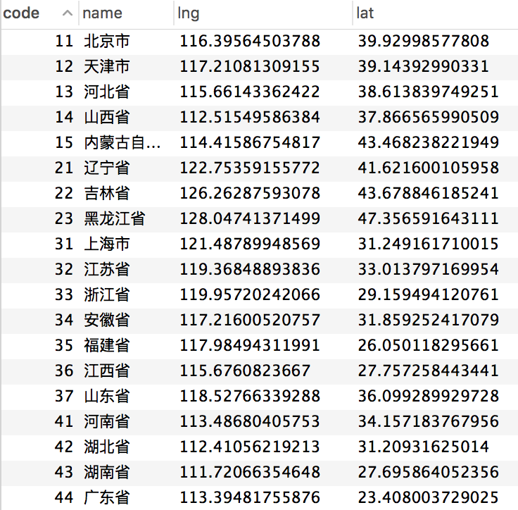

# 中华人民共和国行政区划

## 省份、城市、区县 + 百度经纬度坐标(bd09ll)

*   数据来源（民政部、国家统计局）：
    * [中华人民共和国民政部-中华人民共和国行政区划代码](http://www.mca.gov.cn/article/sj/tjbz/a/)
    * [中华人民共和国国家统计局-行政区划代码](http://www.stats.gov.cn/tjsj/tjbz/xzqhdm/)
    * [中华人民共和国国家统计局-统计用区划和城乡划分代码](http://www.stats.gov.cn/tjsj/tjbz/tjyqhdmhcxhfdm/)
    * [中华人民共和国国家统计局-统计用区划代码和城乡划分代码编制规则](http://www.stats.gov.cn/tjsj/tjbz/200911/t20091125_8667.html)
*   已更新至：
    * [最新县及县以上行政区划代码（截止时间：2016-07-31，发布时间：2017-03-10）](http://www.stats.gov.cn/tjsj/tjbz/xzqhdm/201703/t20170310_1471429.html)
    * [2016年统计用区划代码和城乡划分代码（截止时间：2016-07-31，发布时间：2017-05-16）](http://www.stats.gov.cn/tjsj/tjbz/tjyqhdmhcxhfdm/2016/index.html)

*   参考 [行政区划代码 adcode 映射表](http://mapopen-pub-webserviceapi.bj.bcebos.com/geocoding/%E8%A1%8C%E6%94%BF%E5%8C%BA%E5%88%92%E6%B8%85%E5%8D%95%20V3.0%209.03.xlsx)

## 下载

[pca-code.json](https://github.com/pfinal/city/blob/master/pca-code.json)

[region.sql](https://github.com/pfinal/city/blob/master/region.sql)


```
  中华人民共和国行政区划：
    ✓ 省份数据
    ✓ 城市数据
    ✓ 区县数据
    ✓ “省份、城市” 二级联动数据
    ✓ “省份、城市、区县” 三级联动数据
```


```
[1/1] 正在抓取位置信息...
[1/3317] 当前： 北京市 {"lng":116.39564503787867,"lat":39.92998577808024}
[2/3317] 当前： 天津市 {"lng":117.21081309155257,"lat":39.143929903310077}
[3/3317] 当前： 河北省 {"lng":115.66143362422224,"lat":38.61383974925108}
[4/3317] 当前： 山西省 {"lng":112.51549586383865,"lat":37.86656599050925}
[5/3317] 当前： 内蒙古自治区 {"lng":114.41586754816612,"lat":43.46823822194904}
```




[pca-code.json来源](https://github.com/modood/Administrative-divisions-of-China)